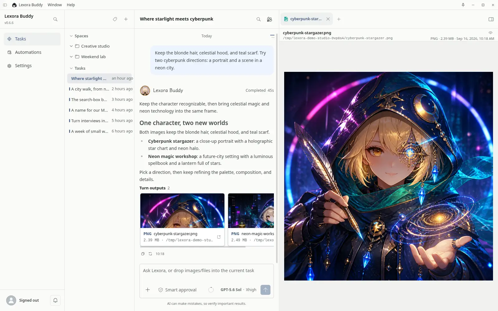
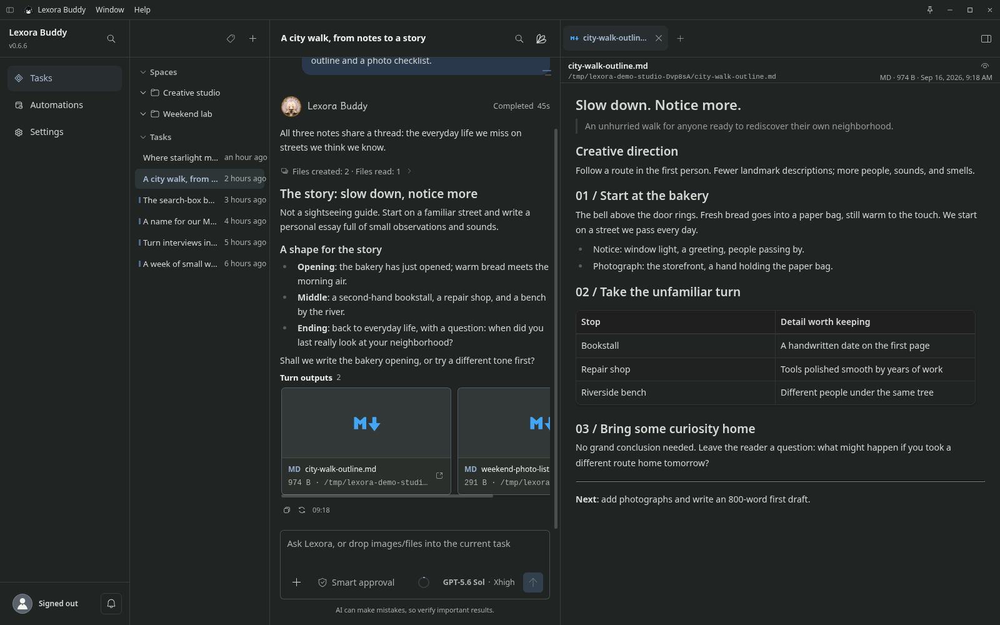
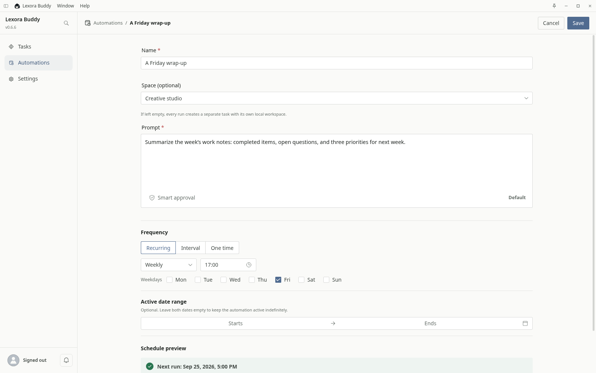
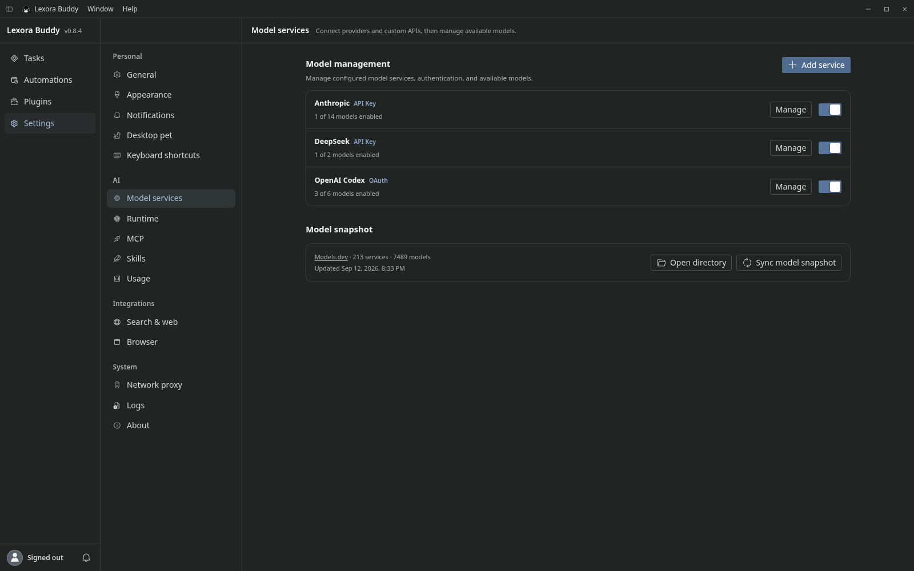
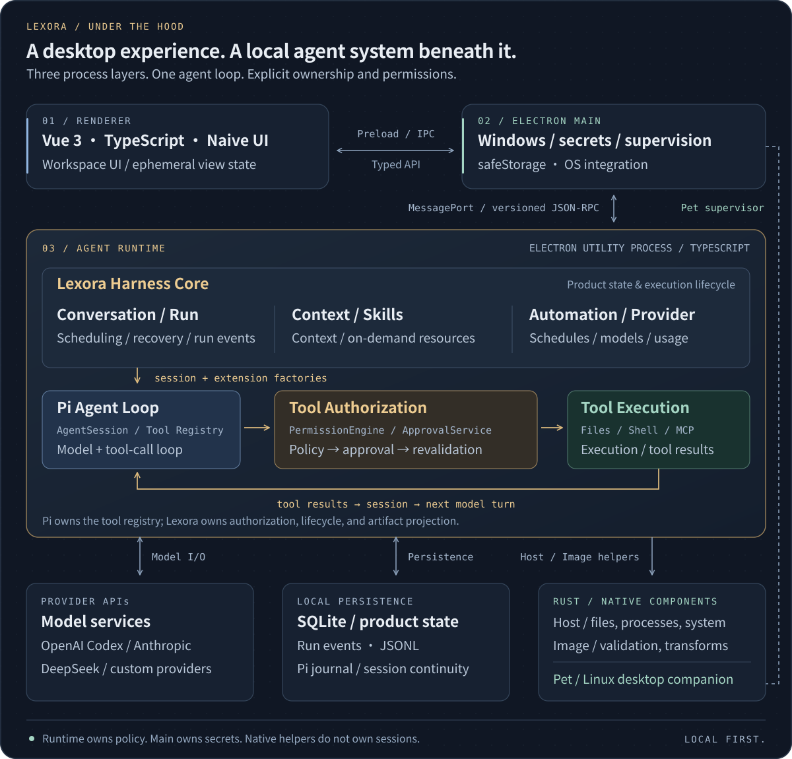

<p align="center">
  
</p>

<h1 align="center">Lexora</h1>

<p align="center">Think alongside you. Act on your intent.</p>

<p align="center">
  <a href="./README.md">中文</a> · <strong>English</strong>
</p>

<p align="center">
  <a href="https://github.com/useLexora/Lexora/actions/workflows/ci.yml"></a>
  <a href="./LICENSE"></a>
</p>

<p align="center">
  <a href="https://github.com/useLexora/Lexora/releases"></a>
  <a href="https://github.com/useLexora/Lexora/releases/latest"></a>
  <a href="https://github.com/useLexora/Lexora/releases/latest"></a>
</p>

<p align="center">
  <a href="https://github.com/useLexora/Lexora/releases/latest">Get Lexora</a>
  ·
  <a href="https://uselexora.app/en/">Website</a>
  ·
  <a href="https://uselexora.app/en/guide/quick-start">Guide</a>
</p>

Lexora is a personal AI workspace built around Desktop. Within the access you grant, it uses local files and tools to turn ideas from conversation into action, making words the starting point for work, creativity, and everyday life.

## Your desktop agent

Lexora brings conversation, local context, and tool execution into one workspace for research, content creation, coding, and everyday automation. From reading files and running commands to producing deliverables, you can follow the work and inspect the results.

You choose the models and authorize access to files and tools. Whether you're moving a project forward or trying out a wild idea, it can start with a conversation.

<table>
  <tr>
    <td width="50%"></td>
    <td width="50%"></td>
  </tr>
  <tr>
    <td width="50%"></td>
    <td width="50%"></td>
  </tr>
</table>

- **Answers are a start. Let's make something.** Read through material, write files, and edit code. Turn the conversation into something you can use.
- **Your models. Your way of working.** Connect the models you prefer, bring your methods along with Skills, and add tools through MCP.
- **Give the routine a schedule.** Let recurring tasks gather work notes and draft weekly updates, leaving a little more room for ideas.
- **A little company on your desktop.** A small desktop pet keeps you company and brings feedback from your tasks.

## Get started

1. [Download the app](https://github.com/useLexora/Lexora/releases/latest) for Windows or Ubuntu / Debian on x64 and ARM64, Arch Linux on x64, or macOS 26+ on Apple Silicon.
2. Connect a model service in settings using its API key or account authorization.
3. Start a task and give Lexora a goal. Choose a working directory when you want to work with files.

No Lexora account is required. Model services have their own terms and charges. Automations need the app to stay running on your computer. Back up important files and review AI-generated results.

See the [guide](https://uselexora.app/en/guide/quick-start) for a walkthrough. The first macOS installation requires the `xattr` command shown in the guide.

## Under the hood

Vue and Electron power the desktop experience; a separate TypeScript runtime hosts the local agent. Lexora manages tasks, context, authorization, and artifacts. Pi provides the agent loop, while Rust handles native capabilities.

[](apps/website/src/public/landing/architecture-en.svg)

Switch models, add tools, and decide what Lexora can access. Product data stays on your computer; online models and external tools receive relevant content when you use them.

## Local development

Requires Node.js 26+, pnpm 11.5+, and Rust. See the [build instructions](packaging/buddy/README.md) for platform dependencies. From the repository root:

```bash
pnpm --filter @uselexora/lexora --filter '@uselexora/lexora-buddy...' --filter @uselexora/lexora-website install --frozen-lockfile
pnpm dev

# for the Website
pnpm dev:website
```

Found a rough edge, or have an idea worth trying? [Open an issue](https://github.com/useLexora/Lexora/issues) or send a PR. Help make Lexora feel a little more at home on your desktop.

## License

[AGPL-3.0-only](LICENSE)

## Friendly links

[LINUX DO — A new ideal community](https://linux.do/)
