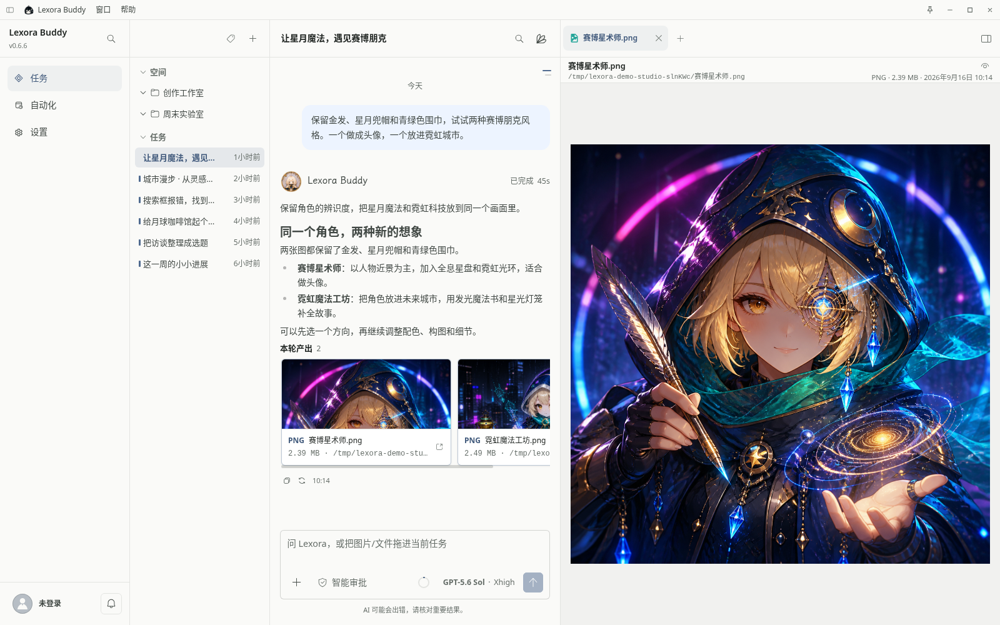
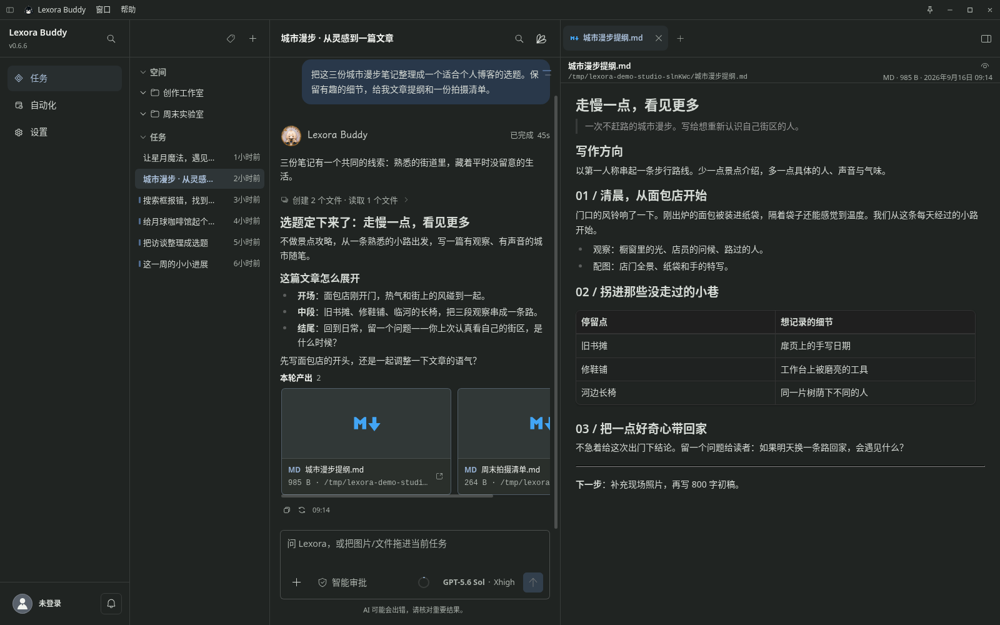
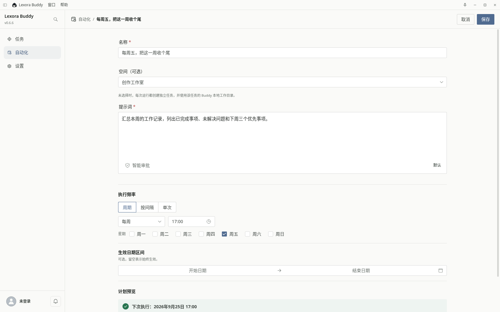
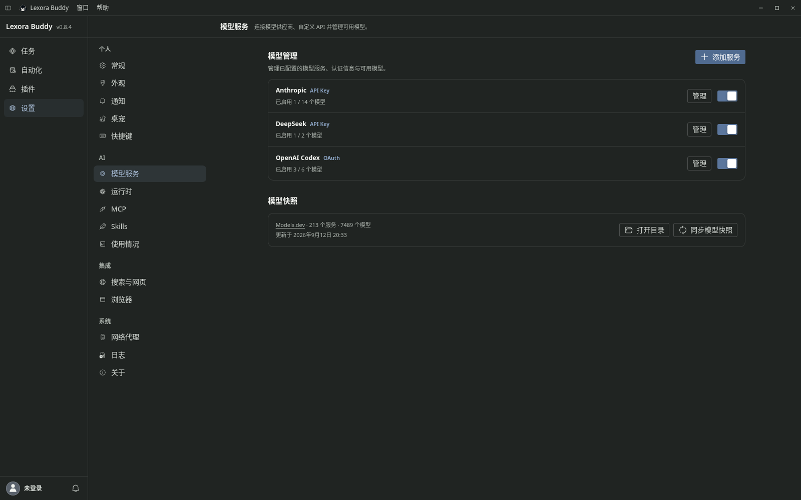
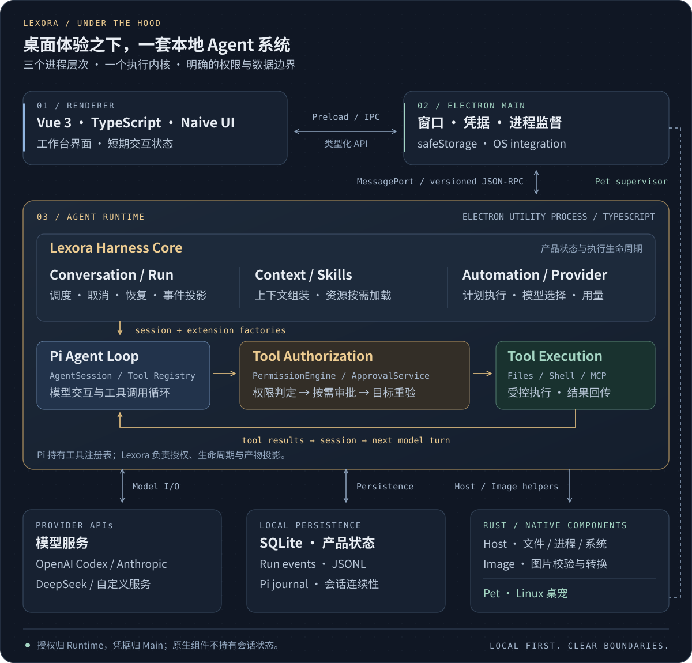

<p align="center">
  
</p>

<h1 align="center">Lexora</h1>

<p align="center">想你所想，行你所行。</p>

<p align="center">
  <strong>中文</strong> · <a href="./README.en.md">English</a>
</p>

<p align="center">
  <a href="https://github.com/useLexora/Lexora/actions/workflows/ci.yml"></a>
  <a href="./LICENSE"></a>
</p>

<p align="center">
  <a href="https://github.com/useLexora/Lexora/releases"></a>
  <a href="https://github.com/useLexora/Lexora/releases/latest"></a>
  <a href="https://github.com/useLexora/Lexora/releases/latest"></a>
</p>

<p align="center">
  <a href="https://github.com/useLexora/Lexora/releases/latest">下载 Lexora</a>
  ·
  <a href="https://uselexora.app/">官网</a>
  ·
  <a href="https://uselexora.app/guide/quick-start">使用指南</a>
</p>

Lexora 是在真实桌面实践中自我演化的个人 AI Agent。不依附单一模型，不局限于代码助手；依托独立的本地执行运行时与安全沙箱，在你授权的范围内调度工具、处理文件与自动化任务，让文字成为工作、创作与生活的起点。

## 你的桌面 Agent

Lexora 将任务对话、本地上下文、沙箱工具执行与产物交付整合在同一套桌面工作流中。从读取资料、运行命令到直接修改代码与生成成果，任务的执行过程与产物都清晰可见。

模型自由接入，文件与工具的访问由你严格授权。无论是推进复杂的日常项目，还是验证一个突发奇想，它都能替你把对话中的想法落为现实。

<table>
  <tr>
    <td width="50%"></td>
    <td width="50%"></td>
  </tr>
  <tr>
    <td width="50%"></td>
    <td width="50%"></td>
  </tr>
</table>

- **不止给答案，也动手做。** 读取资料、编写文件、修改代码，把对话继续成看得见的结果。
- **模型和工具，按你习惯来。** 连接自己的模型，用 Skills 带上熟悉的做事方法，通过 MCP 接入更多工具。
- **琐事排进日程，脑子留给灵感。** 让定时任务整理工作记录、生成周报，把重复的步骤交给自动化。
- **桌面上，还有一点可爱。** 小小的桌宠，陪你开工，也带来任务反馈。

## 开始使用

1. [下载安装包](https://github.com/useLexora/Lexora/releases/latest)：支持 Windows、Ubuntu / Debian 的 x64 与 ARM64，Arch Linux x64，以及 macOS 15+ 的 Apple Silicon。
2. 在设置中连接模型服务，按服务商要求配置 API Key 或账号授权。
3. 新建任务，给 Lexora 一个目标；需要处理文件时，再选择工作目录。

无需注册 Lexora 账号。模型服务的使用条件与费用以服务商为准；自动化需要应用在本机保持运行。重要文件记得备份，AI 生成的结果也请核对。

详细步骤见[使用指南](https://uselexora.app/guide/quick-start)。macOS 首次安装需要按指南执行一次 `xattr` 命令。

## 桌面之下

Vue + Electron 承载桌面体验，独立的 TypeScript Runtime 承载本地 Agent。Lexora 管理任务、上下文、授权与产物；Pi 提供 Agent Loop，Rust 处理原生能力。

[](apps/website/src/public/landing/architecture-zh.svg)

模型可以换，工具可以扩展，文件与工具的访问权限由你决定。产品数据保存在本机；使用在线模型或外部工具时，相关内容会发送给你选择的服务。

## 本地开发

需要 Node.js 26+、pnpm 11.5+ 与 Rust 工具链；平台依赖见[构建说明](packaging/buddy/README.md)。在仓库根目录运行：

```bash
pnpm --filter @uselexora/lexora --filter '@uselexora/lexora-buddy...' --filter @uselexora/lexora-website install --frozen-lockfile
pnpm dev

# 启动官网开发服务
pnpm dev:website
```

遇到问题，或有个值得一试的点子？欢迎[提个 Issue](https://github.com/useLexora/Lexora/issues)，也欢迎通过 PR 一起把 Lexora 打磨得更顺手。

## 许可证

[AGPL-3.0-only](LICENSE)

## 友情链接

[LINUX DO — 新的理想型社区](https://linux.do/)
