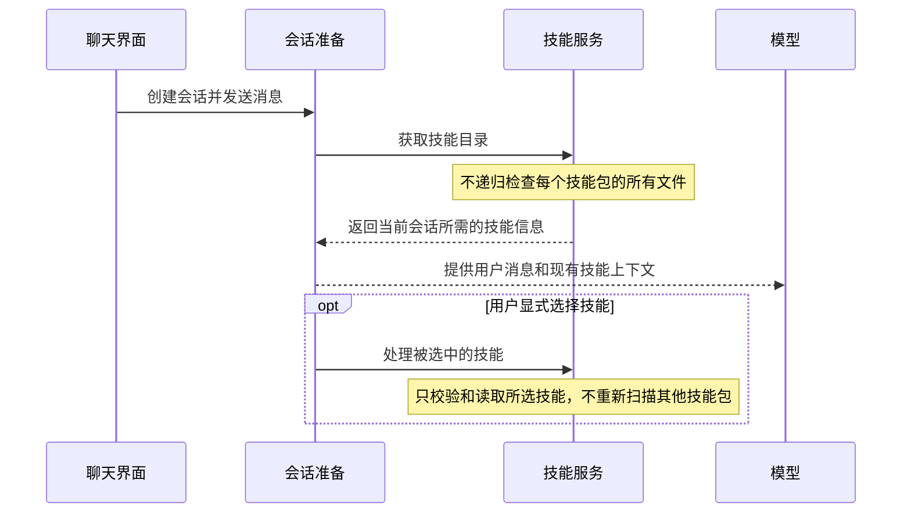

# Spec-004：移除发送前的 Skills 全库扫描

**日期：** 2026-09-27

**状态：** 已按方案完成最小实现，验收清单待复核

**目标：** 普通消息发送和会话准备只发现技能并读取各自的 `SKILL.md`，不递归检查技能附属文件；完整包检查只在安装、更新、明确刷新技能列表或读取所选技能时进行。现有 AI 使用技能的方式保持不变。

## 1. 背景与问题定位

新会话准备会调用 `resolveBuddySessionResources()`，其中等待 `loadForSpace()` 完成。`SkillService` 随后遍历已发现的技能，并为每个技能调用 `SkillPackageCache.load()`。缓存检查函数 `inspectPackage()` 会递归遍历技能目录中的文件；缓存未命中时，`readSkill()` 还会读取整套技能文件。

因此，即使用户发送普通消息、没有选择技能，发送流程也可能先等整个技能库检查完。输入框手动选择技能时，`materializeForSpace()` 也会重新解析候选目录，可能再次处理未选中的技能。

涉及的现有调用点：

- `apps/buddy/service/src/agent/sessions/BuddySessionBlueprintService.ts:128`：创建会话资源。
- `apps/buddy/service/src/agent/resources/BuddySessionResources.ts:32-38`：并行等待技能目录与项目上下文。
- `apps/buddy/service/src/skills/SkillService.ts:90-114`：准备技能列表及组装已选择技能的内容。
- `apps/buddy/service/src/skills/SkillService.ts:347-367`：发现技能并逐个加载包。
- `apps/buddy/service/src/skills/SkillPackageCache.ts:38-99`：缓存命中前递归检查包内文件；未命中则解析完整技能包。
- `apps/buddy/service/src/skills/skillFiles.ts:78-100,151-163`：读取技能包文件并计算版本信息。
- `apps/buddy/service/src/chat/ChatTurnService.ts:558-565,667-690,773-789`：发送前展开输入框中的技能选择或技能上下文。

## 2. 本次范围

本次只处理发送卡顿的直接原因：**会话准备只扫描技能目录并读取各个 `SKILL.md` 的必要信息，不遍历附属文件。**用户没有选择技能时，不应因为技能库中有大量附属文件而等待；用户显式选择技能时，只处理所选技能，不为此重新检查其他技能包。

本次保留现有技能目录、手动选择和模型使用技能的方式。技能实际被读取时仍执行必要的授权和路径安全检查；完整包检查放在安装、更新或用户明确要求检查时。

## 3. 不在本次范围

- 不新增 `load_skill`、`read_skill_resource` 等模型工具。
- 不改变 AI 自动发现、选择或读取技能的方式。
- 不把技能说明和附属文件改造成分阶段读取，也不改变手动选择技能后注入对话的现有语义。
- 不改聊天界面、模型选择、消息展示或发送状态交互。

这些属于后续的 AI 技能使用体验改造，可以在确有需求时另行设计；它们不是消除本次全库扫描卡顿的前提。

## 4. 目标流程

普通消息不再等待所有技能包的文件检查。显式选择技能仍按当前产品行为处理，只避免为了取出所选技能而重新扫描全库。

## 5. 方案

### 5.1 会话准备不递归检查技能包

- 首次会话准备发现技能目录并读取各个 `SKILL.md` 的元数据；不计算包内完整文件签名，也不读取附属文件。结果按空间缓存，后续发送复用。
- 保留必要的基本格式检查、授权来源检查和路径规范化；不合法的目录条目记录诊断并跳过。
- 技能包缓存不能在每次发送前通过遍历包内所有文件来确认命中。安装、更新、删除、启用状态变化会触发缓存更新；打开技能目录列表时也执行一次完整刷新。

### 5.2 用户选中技能时只处理该技能

- `materializeForSpace()` 使用会话准备阶段已有的技能索引或等效引用定位所选技能，不重新枚举并加载全部技能包。
- 保留当前显式选择的交互语义。所选技能仍按现有方式提供给对话；本次不要求只读取 `SKILL.md` 或新增模型工具。
- 读取所选技能时，仍验证其授权范围、规范化路径和必要的文件边界；不因读取一个技能而递归检查其他技能。
- 技能引用使用 `SKILL.md` 内容版本；显式选择还携带完整包版本，以便发现选择后技能包被替换或修改。

### 5.3 技能变化与完整校验

- 完整包校验保留在技能导入、安装、更新或用户明确刷新技能目录时，不放在每轮发送的同步路径上。
- 普通发送复用进程内缓存的技能目录。外部目录新增或删除的技能会在用户刷新技能目录或重启应用后被发现；本次不增加文件系统监听器。
- 用户选中技能时仍重新校验该技能包。如果 `SKILL.md` 或授权路径自目录缓存后发生变化，返回明确的 `SKILL_CHANGED` 错误并失效目录缓存；不会静默切换到其他同名技能。

## 6. 预期改动范围

以现有实现为准，预计集中在技能服务和缓存逻辑：

| 文件或模块 | 计划调整 |
|---|---|
| `apps/buddy/service/src/skills/SkillService.ts` | 让会话目录准备走轻量路径；显式选择技能时通过已有目录索引直接处理所选项 |
| `apps/buddy/service/src/skills/SkillPackageCache.ts` | 增加只读 `SKILL.md` 元数据的路径；完整包检查用于明确刷新或所选技能 |
| `apps/buddy/service/src/skills/skillFiles.ts` | 为 `SKILL.md` 计算轻量引用版本；保留所选技能的路径与文件安全检查 |
| `apps/buddy/service/src/agent/resources/BuddySessionResources.ts` | 如有必要，调整为传递轻量技能目录或会话内已有引用 |
| `apps/buddy/shared/skills/skillApi.ts` 和 `apps/buddy/src/modules/tasks/state/composer/useComposerContextOptions.ts` | 让手动选择同时携带轻量说明版本和完整包版本 |

不新增 Agent 技能工具或新的技能调用协议。

## 7. 验收标准

- [ ] 不选择技能发送普通消息时，会话准备只读取技能元数据，不递归检查任一技能包的附属文件。
- [ ] 会话准备耗时不随技能包附属文件总数成比例增加。
- [ ] 手动选择一个技能时，只处理所选技能，不重新加载或校验其他技能包。
- [ ] 所选技能仍受现有授权、路径穿越、软链接边界及文件类型限制保护。
- [ ] 所选技能的说明或授权路径在会话期间变更或失效时返回明确错误，不静默切换到其他同名技能。
- [ ] 完整技能包校验仍可在安装、更新或用户明确检查时执行。

## 8. 风险和取舍

- 外部技能目录的新增和删除不会在每轮普通发送时自动发现，需要刷新技能目录或重启应用。这是避免再次引入每轮全库扫描所接受的取舍。
- 本次不解决“AI 是否能自动挑选技能”或“附属资料是否按需进入上下文”。如果后续需要这些能力，再单独评估模型工具、上下文和交互变化。
- 为避免发送变慢而移除同步全库检查，不代表放弃安全校验：授权和路径边界仍在技能实际读取时检查，完整包检查仍可在安装或显式检查时运行。

## 9. 后续可选方向

如果未来要让 AI 更灵活地使用 Skills，可以另立方案评估：先提供技能名称和简介，AI 判断需要时再读取说明，并在需要时读取单个附属文件。Pi、Agent Skills 规范和 Codex 都介绍了类似的分层读取方式，但这不是本次性能修复的验收条件。

- [Pi Skills 文档](https://github.com/earendil-works/pi/blob/main/packages/coding-agent/docs/skills.md)
- [Agent Skills 规范](https://agentskills.io/specification)
- [Codex Skills 文档](https://developers.openai.com/plugins/concepts/skills)

---

**状态说明：** 普通发送的轻量目录缓存、显式技能选择时的单技能校验，以及技能列表刷新路径已按本方案实现。当前 Windows 环境不能创建符号链接，因此依赖符号链接的安全测试未能运行通过；验收清单保留待在具备该权限的环境复核。
